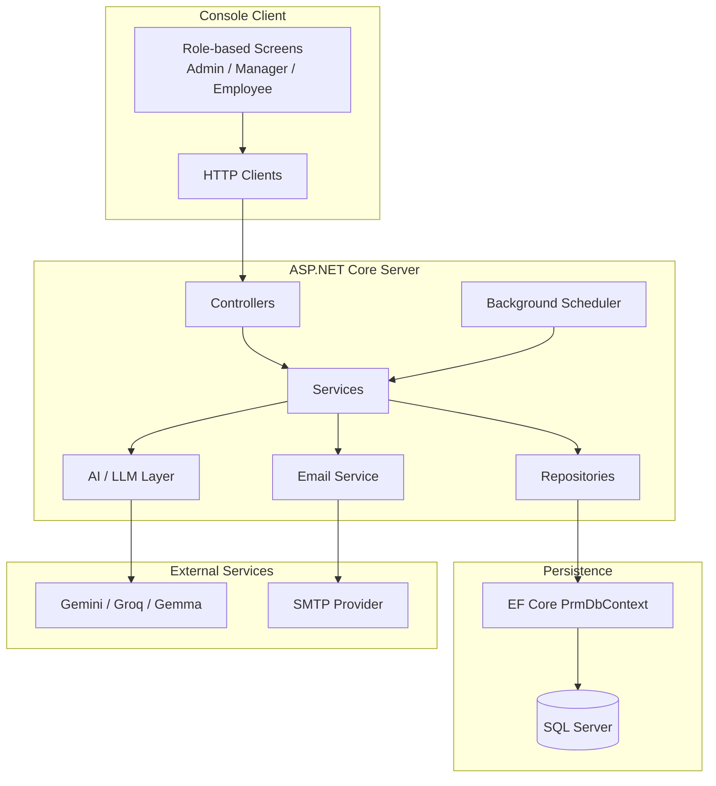

# PRM Platform

> Centralized resource planning for IT services teams — replacing spreadsheets with a structured API and console client.


Manage employees, skills, projects, allocations, and timesheets from a single system. Delivery managers get AI-assisted skill matching and automated project health alerts. Admins get full audit trails and system control.

---

## Requirements

- [.NET 10 SDK](https://dotnet.microsoft.com/download)
- SQL Server (LocalDB, Express, or full instance)
- SMTP credentials _(optional — for email notifications)_
- LLM API key _(optional — for AI features)_

---

## Getting Started

### 1. Configure the database

In `Server/appsettings.json`:

```json
"ConnectionStrings": {
  "DefaultConnection": "Server=YOUR_SERVER;Database=prm_platform_db;Trusted_Connection=True;TrustServerCertificate=True;"
}
```

### 2. Set the JWT secret

```bash
cd Server
dotnet user-secrets set "JwtSettings:SecretKey" "your-secret-key-minimum-32-characters"
```

### 3. Build and test

```bash
dotnet build PRMPlatform.sln
dotnet test PRMPlatform.sln
```

### 4. Run

Start the server first, then the client in a separate terminal.

```bash
# Terminal 1
dotnet run --project Server

# Terminal 2
dotnet run --project Client
```

The server runs migrations and seeds a default admin on first launch — no manual SQL scripts needed.

| | URL |
|---|---|
| API | `http://localhost:5000` |
| Swagger | `http://localhost:5000/swagger` |
| Health | `http://localhost:5000/health` |

**Default admin credentials:** `admin` / `Admin@1234`
You'll be prompted to change the password on first login.

---

## Architecture



Request flow: `Controller → Service → Repository → PrmDbContext → SQL Server`

---

## User Roles

| Role | Can do |
|------|--------|
| **Admin** | Manage users, employees, skills, projects, system config, audit logs |
| **Manager** | Allocate resources, monitor project health, view timesheets, use AI assistant |
| **Employee** | Submit weekly timesheets, view own allocations |

---

## Project Structure

```
PRMPlatform.sln
├── Server/          # REST API — controllers, services, repositories, scheduler, AI, email
├── Client/          # Console UI — role-based screens, typed HTTP clients
└── Tests/           # Unit tests (xUnit + Moq)
```


---

## Tech Stack

.NET 10 · ASP.NET Core · Entity Framework Core · SQL Server · JWT · FluentValidation · BCrypt · MailKit · Polly · xUnit · Moq