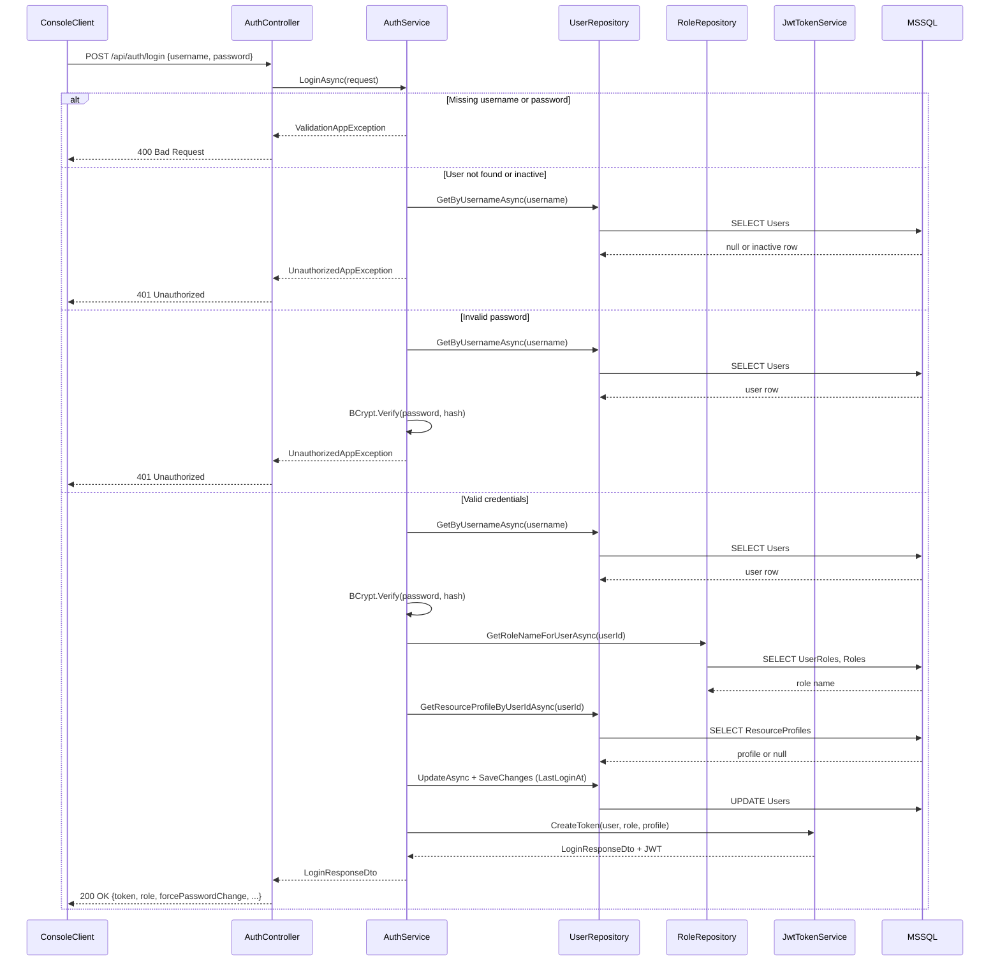
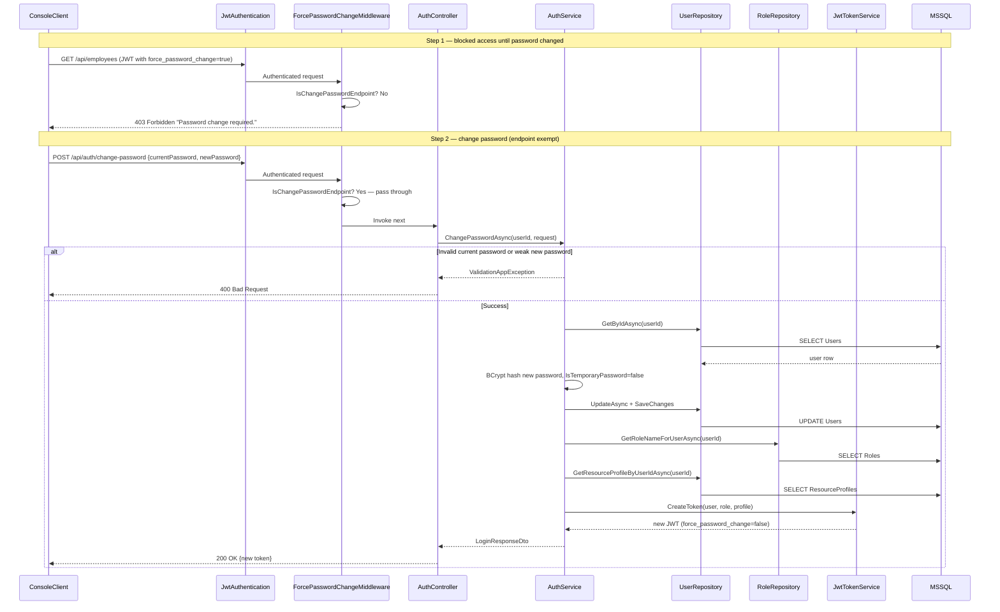
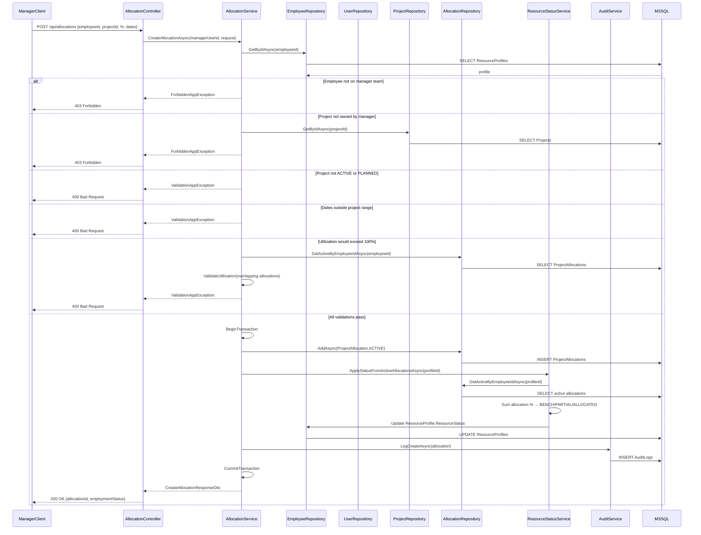
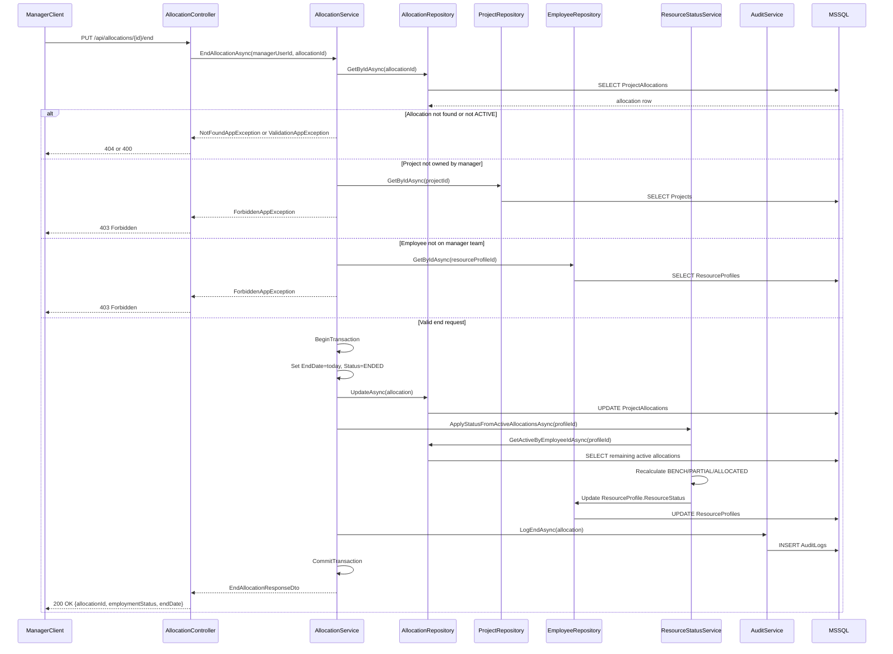
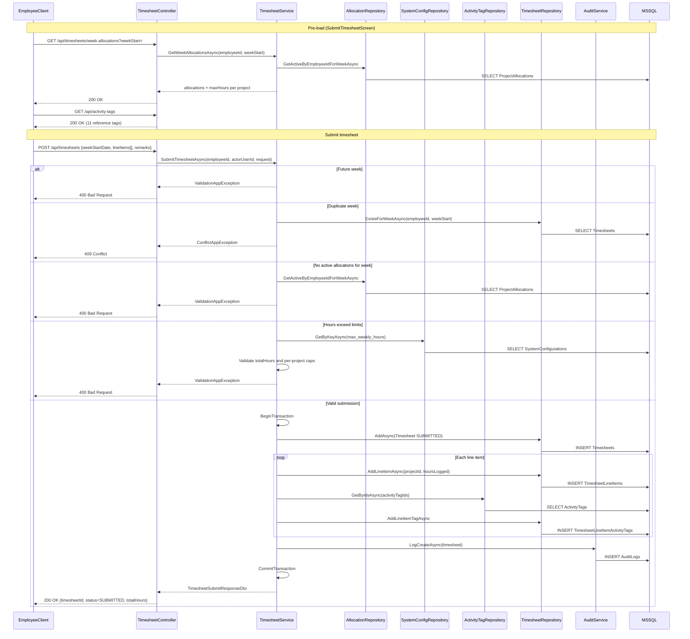
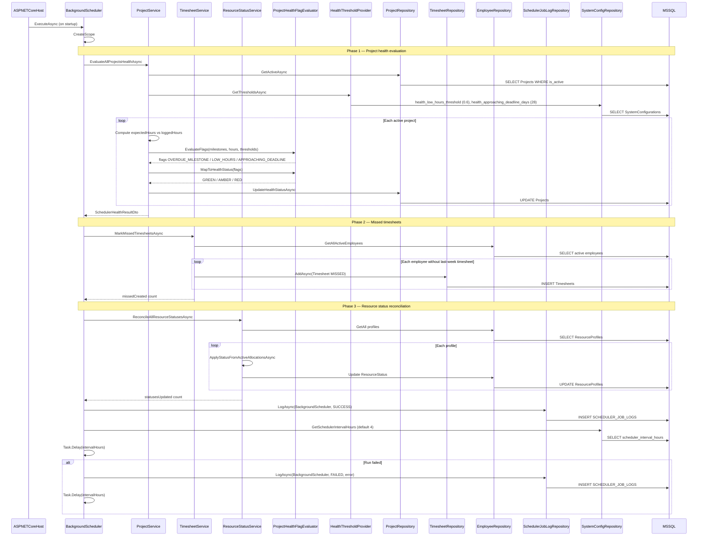

# PRM Platform — Sequence Diagrams (Critical Flows)

This document describes the six critical end-to-end flows implemented in PRM Platform Milestone 2. Each diagram maps to real code in `Server/` and `Client/`.

For the full endpoint inventory see [API_ENDPOINT_STATUS.md](../API_ENDPOINT_STATUS.md). For the data model see [erDiagram.md](./erDiagram.md).

---

## Legend

| Layer | Responsibility |
|-------|----------------|
| **Client** | Console app (`PRMPlatform/Client`) — sends HTTP requests with JWT |
| **Middleware** | JWT authentication, force-password gate, exception handling |
| **Controller** | HTTP routing, auth role checks, request/response mapping |
| **Service** | Business rules, transactions, audit logging |
| **Repository** | EF Core data access |
| **DB** | MSSQL (`prm_platform_db`) |

**Architecture:** `Client → Middleware → Controller → Service → Repository → DB`

---

## 1. Login & JWT Authentication

| | |
|---|---|
| **Trigger** | User enters credentials on `LoginScreen` |
| **Endpoint** | `POST /api/auth/login` |
| **Auth** | Anonymous |
| **Outcome** | JWT returned with claims: `sub`, `role`, `name`, `force_password_change`, `employee_id`, `manager_id` |

**Key files:** `Server/Controllers/Auth/AuthController.cs`, `Server/Services/Auth/AuthService.cs`, `Server/Program.cs`

---

## 2. Force Password Change

| | |
|---|---|
| **Trigger** | User logs in with `IsTemporaryPassword = true` (new account or admin reset) |
| **Endpoint** | `POST /api/auth/change-password` (exempt from middleware block) |
| **Auth** | JWT required |
| **Outcome** | New JWT issued with `force_password_change = false`; user can access protected endpoints |

**Key files:** `Server/Middleware/ForcePasswordChangeMiddleware.cs`, `Client/Screens/ChangePasswordScreen.cs`

---

## 3. Create Allocation (Manager)

| | |
|---|---|
| **Trigger** | Manager allocates a bench/team employee to a project via `AllocateResourceScreen` |
| **Endpoint** | `POST /api/allocations` |
| **Auth** | Manager role |
| **Outcome** | Active allocation created; employee resource status recalculated (BENCH / PARTIALLY_ALLOCATED / ALLOCATED) |

**Key files:** `Server/Services/Allocations/AllocationService.cs`, `Server/Services/Employees/ResourceStatusService.cs`

---

## 4. End Allocation & Resource Status Reconcile

| | |
|---|---|
| **Trigger** | Manager ends an active allocation via `AllocateResourceScreen` |
| **Endpoint** | `PUT /api/allocations/{id}/end` |
| **Auth** | Manager role |
| **Outcome** | Allocation status set to ENDED; employee resource status recalculated from remaining active allocations |

**Key files:** `Server/Services/Allocations/AllocationService.cs`, `Server/Services/Employees/ResourceStatusService.cs`

---

## 5. Submit Timesheet (Employee)

| | |
|---|---|
| **Trigger** | Employee submits weekly hours on `SubmitTimesheetScreen` |
| **Endpoints** | Pre-load: `GET /api/timesheets/week-allocations`, `GET /api/activity-tags` · Submit: `POST /api/timesheets` |
| **Auth** | Employee role |
| **Outcome** | Timesheet saved with status SUBMITTED; line items and activity tags persisted |

**Key files:** `Server/Services/Timesheets/TimesheetService.cs`, `Client/Screens/Employee/SubmitTimesheetScreen.cs`

---

## 6. Background Scheduler Tick

| | |
|---|---|
| **Trigger** | Server starts (`dotnet run --project Server`); repeats every `scheduler_interval_hours` (default 4) |
| **Endpoint** | None — internal `IHostedService` |
| **Auth** | N/A (server process) |
| **Outcome** | Project health updated, missed timesheets created, resource statuses reconciled, run logged to `SCHEDULER_JOB_LOGS` |

**Key files:** `Server/Scheduler/BackgroundScheduler.cs`, `Server/Services/Projects/ProjectHealthFlagEvaluator.cs`, `Server/Common/HealthThresholdDefaults.cs`

**Health threshold defaults:**

| Config key | Default | Purpose |
|------------|---------|---------|
| `health_low_hours_threshold` | `0.6` | Flag LOW_HOURS when logged &lt; 60% of expected |
| `health_approaching_deadline_days` | `28` | Flag APPROACHING_DEADLINE when end date within 28 days |

---

## Appendix — Other Implemented Endpoints (Not Diagrammed)

These flows follow the same layered pattern (`Controller → Service → Repository → DB`) but are simple CRUD or read operations.

| Module | Method | Path | Auth | Status |
|--------|--------|------|------|--------|
| **Users** | POST | `/api/users` | Admin | Create user + optional employee profile |
| **Users** | GET | `/api/users` | Admin | List all users |
| **Users** | PUT | `/api/users/{id}` | Admin | Update name/email |
| **Users** | PUT | `/api/users/{id}/roles` | Admin | Replace user role |
| **Users** | PUT | `/api/users/{id}/reset-password` | Admin | Reset temp password |
| **Users** | PUT | `/api/users/{id}/deactivate` | Admin | Deactivate + end allocations |
| **Users** | PUT | `/api/users/{id}/reactivate` | Admin | Reactivate user |
| **Employees** | GET | `/api/employees` | Admin | List employees |
| **Employees** | GET | `/api/employees/{id}` | Admin | Employee detail |
| **Employees** | PUT | `/api/employees/{id}` | Admin | Update employee |
| **Employees** | PUT | `/api/employees/{id}/deactivate` | Admin | Deactivate employee |
| **Employees** | PUT | `/api/employees/{id}/manager` | Admin | Assign manager |
| **Employees** | POST/PUT/DELETE | `/api/employees/{id}/skills[...]` | Admin | Skill CRUD |
| **Employees** | GET | `/api/employees/my-team` | Manager | Team dashboard |
| **Employees** | GET | `/api/employees/my-team/{id}` | Manager | Team member detail |
| **Projects** | POST | `/api/projects` | Admin | Create project |
| **Projects** | GET | `/api/projects` | Admin | List projects (with healthStatus) |
| **Projects** | GET | `/api/projects/{id}` | Admin | Project detail |
| **Projects** | PUT | `/api/projects/{id}` | Admin | Update project |
| **Projects** | PUT | `/api/projects/{id}/archive` | Admin | Archive project |
| **Projects** | GET/POST/PUT | `/api/projects/{id}/milestones[...]` | Admin | Milestone CRUD |
| **Projects** | GET | `/api/projects/my` | Manager | Manager project list |
| **Projects** | GET | `/api/projects/{id}/manager` | Manager | Manager project detail + health flags |
| **Allocations** | PUT | `/api/allocations/{id}` | Manager | Update allocation %/dates |
| **Allocations** | GET | `/api/allocations` | Admin | List allocations |
| **Allocations** | GET | `/api/allocations/my` | Employee | My allocations |
| **Timesheets** | GET | `/api/timesheets/my` | Employee | Timesheet history |
| **Timesheets** | GET | `/api/timesheets/my/{id}` | Employee | Timesheet detail |
| **Timesheets** | GET | `/api/timesheets/reminder` | Employee | Missed timesheet reminder |
| **Timesheets** | GET | `/api/timesheets/team` | Manager | Team timesheets by week |
| **Timesheets** | GET | `/api/timesheets/{id}` | Manager | Timesheet detail |
| **System Config** | GET | `/api/system-config` | Admin | Read all config (API key masked) |
| **System Config** | PUT | `/api/system-config` | Admin | Partial config update |
| **AI** | GET | `/api/ai/projects/{id}/risk-summary` | Manager | **Phase 8 — NotImplementedException** |
| **AI** | GET | `/api/ai/projects/{id}/skill-match` | Manager | **Phase 8 — NotImplementedException** |

---

## Out of Scope

- **AI integration** — endpoints and LLM clients exist but throw `NotImplementedException` (Phase 8)
- **Console menu navigation** — client-side routing only, no server interaction
- **Simple GET flows** — listed in appendix; same request/response pattern as diagrammed flows
